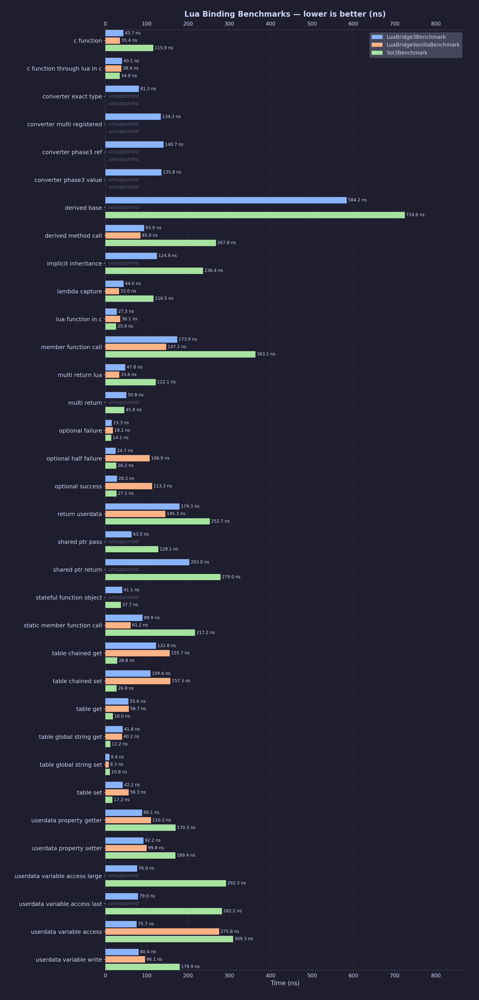

<p float="left">
  <a href="https://kunitoki.github.io/LuaBridge3">
    <picture>
      <source media="(prefers-color-scheme: dark)" srcset="./Images/logo-dark.png">
      
    </picture>
  </a>
  &nbsp;&nbsp;&nbsp;&nbsp;
  <a href="https://lua.org">
    <picture>
      <source media="(prefers-color-scheme: dark)" srcset="./Images/lua-dark.png">
      
    </picture>
  </a>
</p>

[](https://coveralls.io/github/kunitoki/LuaBridge3?branch=master)
[](https://github.com/kunitoki/LuaBridge3/actions/workflows/build_macos.yml)
[](https://github.com/kunitoki/LuaBridge3/actions/workflows/build_windows.yml)
[](https://github.com/kunitoki/LuaBridge3/actions/workflows/build_linux.yml)
[](https://github.com/kunitoki/LuaBridge3/actions/workflows/build_ubsan.yml)
[](https://github.com/kunitoki/LuaBridge3/actions/workflows/build_asan.yml)
<br/>
[](https://www.lua.org/manual/5.1/readme.html)
[](https://www.lua.org/manual/5.2/readme.html)
[](https://www.lua.org/manual/5.3/readme.html)
[](https://www.lua.org/manual/5.4/readme.html)
[](https://www.lua.org/manual/5.5/readme.html)
[](https://luajit.org/luajit.html)
[](https://luau.org/)
[](https://ravilang.github.io/)

# LuaBridge 3.0

[LuaBridge3](https://github.com/kunitoki/LuaBridge3) is a lightweight and dependency-free library for mapping data,
functions, and classes back and forth between C++ and [Lua](http://wwww.lua.org) (a powerful,
fast, lightweight, embeddable scripting language). LuaBridge has been tested
and works with:
* [PUC-Lua](https://lua.org) 5.1.5, 5.2.4, 5.3.6, 5.4.8 and 5.5.0
* [LuaJit](https://luajit.org/) 2.1
* [Luau](https://luau-lang.org/) 0.713
* [Ravi](https://github.com/dibyendumajumdar/ravi) 1.0-beta11

## Features

LuaBridge3 is usable from a compliant C++17 compiler and offers the following features:

* [MIT Licensed](https://www.opensource.org/licenses/mit-license.html), no usage restrictions!
* Headers-only: No Makefile, no .cpp files, just one `#include` and one header file (optional) !
* Works with ANY lua version out there (PUC-Lua, LuaJIT, Luau, Ravi, you name it).
* Simple, light, and nothing else needed.
* Competitive performance with the fastest C++/Lua binding libraries available.
* Fast to compile (even in release mode), scaling linearly with the size of your binded code.
* No macros, settings, or configuration scripts needed.
* Supports different object lifetime management models.
* Convenient, type-safe access to the Lua stack.
* Automatic function parameter type binding.
* Functions and constructors overloading support.
* Easy access to Lua objects like tables and functions.
* Expose C++ classes allowing them to use the flexibility of lua property lookup.
* Interoperable with a wide range of C++ standard library types, including containers, smart pointers, and modern C++17/20/23 additions.
* Written in a clear and easy to debug style.

## Performance

LuaBridge3 has been heavily optimized and now competes directly with [sol2](https://github.com/ThePhD/sol2) — one of the fastest C++/Lua binding libraries — across most workloads.

Benchmarks measure the overhead each library adds on top of the plain Lua C API: the cost of abstracting and wrapping it for C++ use. All libraries are compiled together with the benchmark executable (no separate Lua DLL) so that inlining and link-time optimizations reflect real-world usage scenarios. Every library runs with its maximum safety settings enabled — the numbers represent what you actually ship, not a stripped-down, crash-prone configuration.

The benchmark suite covers common operations: global and table access, free and member function calls, userdata property access across class hierarchies, shared-pointer ownership, multi-return functions, lambda captures, custom type converters. Each case is run in isolation so the numbers are directly comparable between libraries.



## Improvements Over Vanilla LuaBridge

LuaBridge3 offers a set of improvements compared to vanilla LuaBridge:

* The only binder library that works with PUC-Lua as well as LuaJIT, Luau and Ravi, wonderful for game development !
* Faster runtime execution for most common use cases, playing in the same league as the fastest binders in town.
* Can work with both c++ exceptions and without (Works with `-fno-exceptions` and `/EHsc-`).
* Full support for capturing lambdas in all namespace and class methods.
* Overloaded functions support in Namespace functions, Class constructors, functions and static functions.
* Multiple inheritance: `deriveClass<D, A, B, ...>` supports any number of registered base classes.
* Supports placement allocation or custom allocations/deallocations of C++ classes exposed to lua.
* Lightweight object creation: allow adding lua tables on the stack and register methods and metamethods in them.
* Instance metamethods fallbacks via `__index` and `__newindex` in exposed C++ classes.
* Static metamethod fallbacks via `__index` and `__newindex` in exposed C++ classes on the class static table.
* Custom destructor hook via `addDestructor` (`__destruct` metamethod) called just before the C++ destructor.
* Added `std::shared_ptr` to support shared C++/Lua lifetime for types deriving from `std::enable_shared_from_this`.
* `std::unique_ptr<T>` supported as an ownership container — Lua gets a non-owning view while C++ retains ownership.
* Supports conversion to and from `std::nullptr_t`, `std::byte`, `std::pair`, `std::tuple` and `std::reference_wrapper`.
* Supports conversion to and from C style arrays of any supported type.
* `void*` and `const void*` are transparently mapped to Lua lightuserdata.
* Transparent support of all signed and unsigned integer types up to `int64_t`.
* Consistent numeric handling and conversions (signed, unsigned and floats) across all lua versions.
* NaN and Inf values pass through floating-point stack conversions without error.
* Simplified registration of enum types via the `luabridge::Enum` stack wrapper.
* C++20 coroutine integration via `addCoroutine()` and `CppCoroutine<R>`; await Lua threads from C++ with `LuaCoroutine`.
* Opt-out handling of safe stack space checks (automatically avoids exhausting lua stack space when pushing values!).
* Optional strict stack conversions via `LUABRIDGE_STRICT_STACK_CONVERSIONS` (e.g. `bool` requires an actual boolean, not any truthy value).
* Error handler support in Lua calls via `LuaRef::callWithHandler` and `luabridge::callWithHandler`.
* `newFunction` free function wraps any C++ callable into a Lua function exposed as a `LuaRef`.
* `LuaFunction<Signature>` provides a strongly-typed callable wrapper around a Lua function.
* `TypeResult<T>::valueOr(default)` allows safe value extraction with an explicit fallback.
* Can safely register and use classes exposed across shared library boundaries.

### Standard Library Container Support

Optional headers enable transparent Lua↔C++ conversion for a wide range of STL containers. Include only what you need:

| Header | Type | Requirement |
|--------|------|-------------|
| `LuaBridge/Array.h` | `std::array<T,N>` | C++17 |
| `LuaBridge/Vector.h` | `std::vector<T>` | C++17 |
| `LuaBridge/Deque.h` | `std::deque<T>` | C++17 |
| `LuaBridge/ForwardList.h` | `std::forward_list<T>` | C++17 |
| `LuaBridge/List.h` | `std::list<T>` | C++17 |
| `LuaBridge/Map.h` | `std::map<K,V>` | C++17 |
| `LuaBridge/MultiMap.h` | `std::multimap<K,V>` | C++17 |
| `LuaBridge/Set.h` | `std::set<K>` | C++17 |
| `LuaBridge/UnorderedMap.h` | `std::unordered_map<K,V>` | C++17 |
| `LuaBridge/UnorderedMultiMap.h` | `std::unordered_multimap<K,V>` | C++17 |
| `LuaBridge/UnorderedSet.h` | `std::unordered_set<K>` | C++17 |
| `LuaBridge/Optional.h` | `std::optional<T>` | C++17 |
| `LuaBridge/Variant.h` | `std::variant<Ts...>` | C++17 |
| `LuaBridge/Any.h` | `std::any` (push-only) | C++17 |
| `LuaBridge/Span.h` | `std::span<T>` (push-only) | C++20 |
| `LuaBridge/StdExpected.h` | `std::expected<T,E>` | C++23 |
| `LuaBridge/FlatMap.h` | `std::flat_map<K,V>` | C++23 |
| `LuaBridge/FlatSet.h` | `std::flat_set<K>` | C++23 |

`std::filesystem::path` is automatically converted to/from a Lua string when C++17 filesystem is available — no additional header required.

### Modern C++ Feature Detection

LuaBridge3 auto-detects available C++ standard library features and activates the corresponding support without any manual configuration. Every feature can be force-disabled with a `LUABRIDGE_DISABLE_*` preprocessor flag if needed:

| Macro | Feature | Standard |
|-------|---------|----------|
| `LUABRIDGE_HAS_CXX17_FILESYSTEM` | `std::filesystem::path` ↔ string | C++17 |
| `LUABRIDGE_HAS_CXX17_ANY` | `std::any` push registry | C++17 |
| `LUABRIDGE_HAS_CXX20_SPAN` | `std::span` push support | C++20 |
| `LUABRIDGE_HAS_CXX20_RANGES` | `Iterator`/`Range` satisfy `std::ranges` concepts | C++20 |
| `LUABRIDGE_HAS_CXX20_COROUTINES` | `CppCoroutine<R>` / `LuaCoroutine` | C++20 |
| `LUABRIDGE_HAS_CXX23_EXPECTED` | `std::expected<T,E>` conversion | C++23 |
| `LUABRIDGE_HAS_CXX23_FLAT_CONTAINERS` | `std::flat_map` / `std::flat_set` | C++23 |
| `LUABRIDGE_HAS_CXX23_MOVE_ONLY_FUNCTION` | `std::move_only_function` as callable | C++23 |

## Documentation

Please read the [LuaBridge3 Reference Manual](https://kunitoki.github.io/LuaBridge3/Manual) for more details on the API.

## Release Notes

Plase read the [LuaBridge3 Release Notes](https://kunitoki.github.io/LuaBridge3/CHANGES) for more details

## Installing LuaBridge3 (vcpkg)

You can download and install LuaBridge3 using the [vcpkg](https://github.com/Microsoft/vcpkg) dependency manager:
```Powershell or bash
git clone https://github.com/Microsoft/vcpkg.git
cd vcpkg
./bootstrap-vcpkg.sh # The name of the script should be "./bootstrap-vcpkg.bat" for Powershell
./vcpkg integrate install
./vcpkg install luabridge3
```

The LuaBridge3 port in vcpkg is kept up to date by Microsoft team members and community contributors. If the version is out of date, please [create an issue or pull request](https://github.com/Microsoft/vcpkg) on the vcpkg repository.

### Update vcpkg

To update the vcpkg port, we need to know the hash of the commit and the sha512 of its downloaded artifact.
Starting from the commit hash that needs to be published, download the archived artifact and get the sha512 of it:

```bash
COMMIT_HASH=$(git rev-parse HEAD)

wget https://github.com/kunitoki/LuaBridge3/archive/${COMMIT_HASH}.tar.gz

shasum -a 512 ${COMMIT_HASH}.tar.gz
# fbdf09e3bd0d4e55c27afa314ff231537b57653b7c3d96b51eac2a41de0c302ed093500298f341cb168695bae5d3094fb67e019e93620c11c7d6f8c86d3802e2 0e17140276d215e98764813078f48731125e4784.tar.gz
```
Now update the version in https://github.com/microsoft/vcpkg/blob/master/ports/luabridge3/vcpkg.json and the commit hash and sha512 in https://github.com/microsoft/vcpkg/blob/master/ports/luabridge3/portfile.cmake then commit the changes.
Enter into vcpkg folder and issue:

```bash
./vcpkg x-add-version --all
```

Commit the changed files and create a Pull Request for vcpkg.

## Unit Tests

Unit test build requires a CMake and C++17 compliant compiler.

These are the unit test targets:
* `LuaBridgeTests51` - uses Lua 5.1 in C++ mode
* `LuaBridgeTests51Noexcept` - uses Lua 5.1 in C++ mode without exceptions enabled
* `LuaBridgeTests51LuaC` - uses Lua 5.1 in C mode
* `LuaBridgeTests51LuaCNoexcept` - uses Lua 5.1 in C mode without exceptions enabled
* `LuaBridgeTests52` - uses Lua 5.2 in C++ mode
* `LuaBridgeTests52Noexcept` - uses Lua 5.2 in C++ mode without exceptions enabled
* `LuaBridgeTests52LuaC` - uses Lua 5.2 in C mode
* `LuaBridgeTests52LuaCNoexcept` - uses Lua 5.2 in C mode without exceptions enabled
* `LuaBridgeTests53` - uses Lua 5.3 in C++ mode
* `LuaBridgeTests53Noexcept` - uses Lua 5.3 in C++ mode without exceptions enabled
* `LuaBridgeTests53LuaC` - uses Lua 5.3 in C mode
* `LuaBridgeTests53LuaCNoexcept` - uses Lua 5.3 in C mode without exceptions enabled
* `LuaBridgeTests54` - uses Lua 5.4 in C++ mode
* `LuaBridgeTests54Noexcept` - uses Lua 5.4 in C++ mode without exceptions enabled
* `LuaBridgeTests54LuaC` - uses Lua 5.4 in C mode
* `LuaBridgeTests54LuaCNoexcept` - uses Lua 5.4 in C mode without exceptions enabled
* `LuaBridgeTests55` - uses Lua 5.5 in C++ mode
* `LuaBridgeTests55Noexcept` - uses Lua 5.5 in C++ mode without exceptions enabled
* `LuaBridgeTests55LuaC` - uses Lua 5.5 in C mode
* `LuaBridgeTests55LuaCNoexcept` - uses Lua 5.5 in C mode without exceptions enabled
* `LuaBridgeTestsLuaJIT` - uses LuaJIT 2.1
* `LuaBridgeTestsLuaJITNoexcept` - uses LuaJIT 2.1 without exceptions enabled
* `LuaBridgeTestsLuau` - uses Luau
* `LuaBridgeTestsRavi` - uses Ravi

(Luau compiler needs exceptions, so there are no test targets on Luau without exceptions)
(Ravi doesn't fully work without exceptions, so there are no test targets on Ravi without exceptions)

Generate Unix Makefiles and build on Linux:
```bash
git clone --recursive git@github.com:kunitoki/LuaBridge3.git

cmake -G "Unix Makefiles" -DCMAKE_CXX_STANDARD=20 -B Build . # Generates Unix Makefiles
cmake --build Build -DCMAKE_BUILD_TYPE=Debug 
# or cmake --build Build -DCMAKE_BUILD_TYPE=Release
# or cmake --build Build -DCMAKE_BUILD_TYPE=RelWithDebInfo
popd
```

Generate XCode project and build on MacOS:
```bash
git clone --recursive git@github.com:kunitoki/LuaBridge3.git

cmake -G Xcode -DCMAKE_CXX_STANDARD=20 -B Build . # Generates XCode project build/LuaBridge.xcodeproj
cmake --build Build -DCMAKE_BUILD_TYPE=Debug
# or cmake --build Build -DCMAKE_BUILD_TYPE=Release
# or cmake --build Build -DCMAKE_BUILD_TYPE=RelWithDebInfo
```

Generate VS2019 solution on Windows:
```cmd
git clone --recursive git@github.com:kunitoki/LuaBridge3.git

cmake -G "Visual Studio 16" -DCMAKE_CXX_STANDARD=20 -B Build . # Generates MSVS solution build/LuaBridge.sln
cmake --build Build -DCMAKE_BUILD_TYPE=Debug 
# or cmake --build Build -DCMAKE_BUILD_TYPE=Release
# or cmake --build Build -DCMAKE_BUILD_TYPE=RelWithDebInfo
```

## Official Repository

LuaBridge3 is published under the terms of the [MIT License](https://www.opensource.org/licenses/mit-license.html).

The original version of LuaBridge3 was written by Nathan Reed. The project has
been taken over by Vinnie Falco, who added new functionality, wrote the new
documentation, and incorporated contributions from Nigel Atkinson. Then it has
been forked from the original https://github.com/vinniefalco/LuaBridge into its
own LuaBridge3 repository by kunitoki, and development continued there.

For questions, comments, or bug reports feel free to open a Github issue
or contact kunitoki directly at the email address indicated below.

Copyright 2020, kunitoki (<kunitoki@gmail.com>)<br>
Copyright 2019, Dmitry Tarakanov<br>
Copyright 2012, Vinnie Falco (<vinnie.falco@gmail.com>)<br>
Copyright 2008, Nigel Atkinson<br>
Copyright 2007, Nathan Reed<br>
